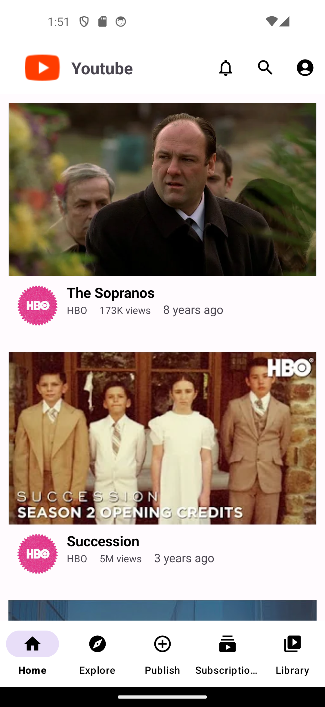
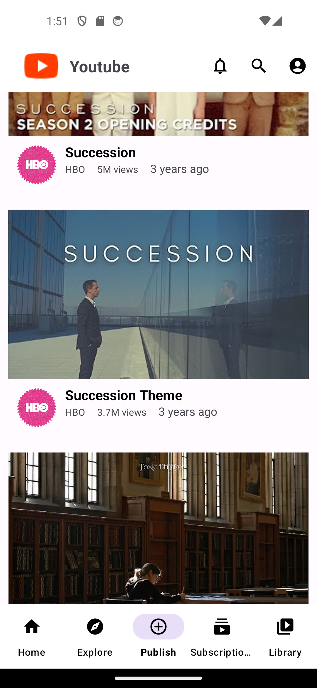
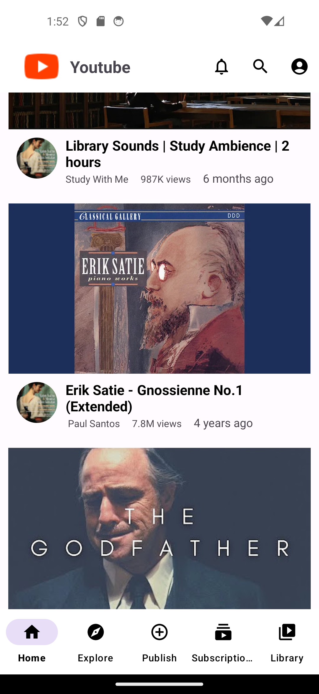
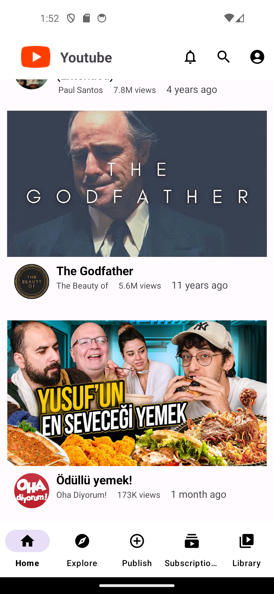

# Youtube Mainpage Clone
A Youtube clone app with android kotlin

## YouTube Clone Project

This project aims to create an analogue of YouTube using the Kotlin programming language. The project was developed using the following technologies:

#### Technologies Used

- **Navigation Component**: It is used for page transitions and navigation within the application. Data transport operations are integrated with the safe argument library.
- **RecyclerView**: Used for the main screen where videos are listed.
- **ViewBinding**: It is used to access layouts and bind data.
- **Toolbar**: Used for page titles and application menu.
- **BottomNavigationBar**: It is integrated to facilitate navigation within the application.
- **Fragment**: It is used to represent different screens in the application.
- **Safe Args**: It is used for secure data transport between fragments.

### Project Details

The project includes a user interface design in version one and provides transitions between pages with the Navigation Component. The "safe argument" library has been integrated and tested for moving data between fragments.

### How to Run

1. Clone this repository: 
   ```bash
   git clone <repository_link>
   ```

2. Open the project using an IDE such as Android Studio or IntelliJ IDEA.

3. Run the project and test it on an emulator or a physical device.

### Screenshots

<div>
  
  
  
  
</div>


### Contribution

If you would like to contribute to the project, please create a fork and provide your improvements. Waiting for your pull requests!


